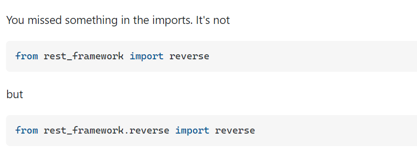

This is done by following the documentation in Django REST framework website.

# Models

These control how the information is stored inside the database, if you explore sqlite3 then you will see the stored info

`python manage.py makemigrations snippets`

The above cli command, readies the model to be added

`python manage.py migrate snippets` 

This cli command, actually adds it to the database

`python manage.py migrate`

Adds all the pending migrations to the database

for specific models

# Views

I have three different implementations for URL views. 

# tutorial/settings

Make sure to include the framework and each app like snippets inside it which you created using "startapp"

# Authenication

After adding the permission classes, we need to authenicate users in order for them to create new snippets or for the owners of their snippets to edit them. 

Base authentication classes like SessionAuthenication and BasicAuthenication are used by default. 

If the api is accessed through a browser then the browser login handles the authentication. or else Programmatically you have send the credentials.

# settings

Note that settings in REST framework are all namespaced into a single dictionary setting, named REST_FRAMEWORK, which helps keep them well separated from your other project settings.

# rename apps

if you happen to rename the folder of the apps to something else, make sure to change it in apps.py as well.

for example snippets --> snippetLOL
snippets/apps.py ---> name="snippetLOL"

# reverse

# Tips

- Whenever you create a new app, make sure to include it in the installed_apps in settings.py in root